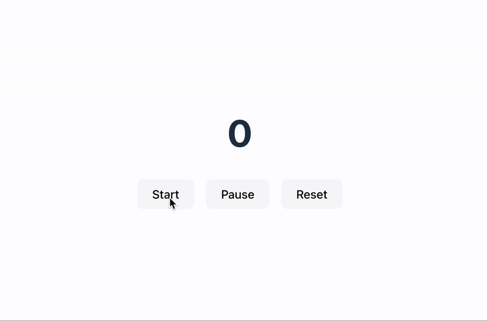

# React Timer

A simple **React Timer** app built with the specific goal of exploring key React concepts:

- `useEffect` and side effects
- `useState` for reactive state management
- `useRef` for persistent mutable values
- **react-router** for navigation between pages
- Writing clean, maintainable code with proper memory handling

---

## Installation

```
git clone https://github.com/simonegarofalo/learning-react.git
cd learning-react
npm install
npm run dev
```

---

## Project Structure

```txt
src/
├── App.jsx
├── App.css
├── index.css
├── main.jsx
├── components/
│   └── Timer.jsx
├── pages/
│   └── AthletePage.jsx
├── routes/
│   └── AppRoutes.jsx

```

---

### How it works

- `useState` holds the current count and running state

- `useRef` stores the interval ID and timing references to avoid unnecessary re-renders

- `useEffect` watches the `isRunning` flag:

  - Starts the timer if isRunning is true and no interval is active
  - Clears the timer when isRunning is false
  - Ensures cleanup when the component unmounts

- **react-router** allows navigation to individual athlete pages

---

Developed by <a href="https://github.com/simonegarofalo">simonegarofalo</a>

Feel free to fork, use, or contribute to the project.
